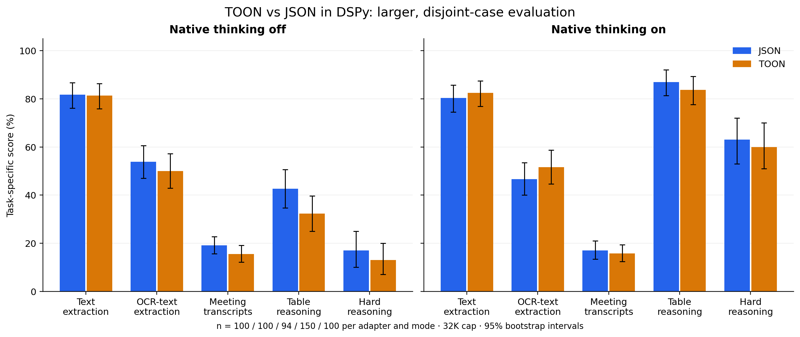
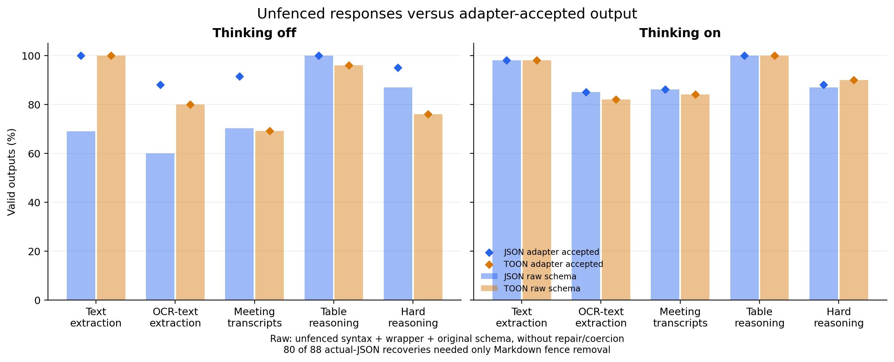
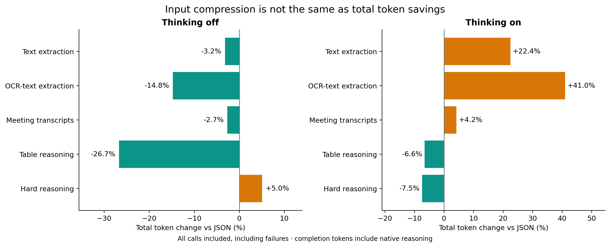
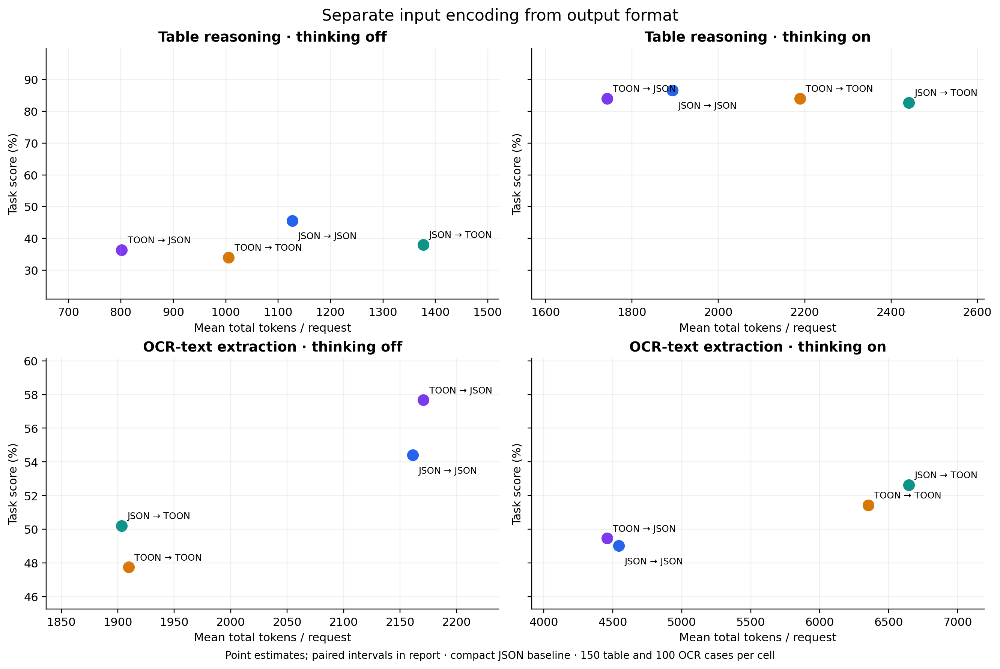
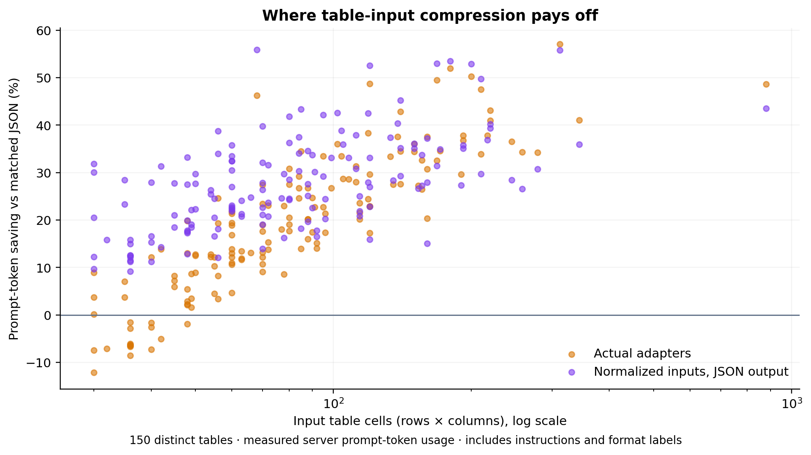

# TOON vs JSON in DSPy: expanded evidence for the blog

Later study: [upstream input comprehension and tool-result comparison](../qwen_input_study/INTERPRETATION.md). It examines TOON as an input encoding with fixed output and qualifies the earlier broad winner/hybrid conclusions.

4,376 new scored generation requests: 4,176 in the main randomized comparison and 200 in a separate native-JSON-schema check. The main study contains **544 new cases**, with exact pilot contexts/tables/questions excluded. No adapter source or prompts were tuned during this run. Two native-mode compatibility probes are separate.

**Read the actual-adapter comparison and the normalized input/output ablation separately.** The former measures the current DSPy JSON and TOON prompt/parser implementations. The latter changes input serialization while holding the chosen output contract fixed; it includes the TOON-input/JSON-output hybrid. Native JSON-schema mode is a third, separately labeled experiment.

## Findings worth building the article around

- **Compression can trade away accuracy.** On 150 table questions without thinking, actual TOON used 26.7% fewer total tokens but scored 32.3% versus JSON’s 42.7%. The paired score gap was -10.3 percentage points, with a 95% interval of [-16.7, -4.3].
- **The hybrid hypothesis did not become a general recommendation.** With JSON output held fixed, TOON table inputs saved 28.9% total tokens without thinking but reduced score by 9.2 points. With thinking, the score gap narrowed to -2.7 points and its interval reached zero.
- **Shorter inputs do not guarantee cheaper completions.** On OCR-text extraction with thinking, actual TOON used 41.0% more total tokens. Its observed 5.0-point score advantage was inconclusive at the reported 95% interval.
- **Separate syntax from usefulness.** Native JSON-schema decoding yielded 200/200 schema-valid responses on the selected compatible subset; task scores remained far below 100%. Most raw-format failures recovered by the ordinary JSON adapter were just Markdown fences.

These findings support keeping JSON as the default for this deployment and evaluating TOON on the application's own data shape and accuracy budget. They do not establish a universal format ranking.

Follow-up: [payload and trace audit](trace_audit/README.md) distinguishes answer-content errors from type and presentation penalties. In the table/thinking-off disagreements, four TOON outputs contained the correct number with the wrong scalar type, and two contained the gold answer with different presentation. The scores below remain the original official contract-based scores.

## Actual adapters: task quality

Percent scores, **thinking off / on**, with the same 32,768-token cap for both modes. SOB uses official schema-gated leaf-value exact match; TableBench uses its official normalized numerical match; BBEH uses official correctness. Compare within rows. Invalid outputs remain in denominators.

| Workload | Cases per cell | DSPy JSON | TOON 4.1 |
|---|---:|---:|---:|
| SOB text extraction | 100 | 81.7 / 80.4 | 81.3 / 82.5 |
| SOB OCR-text extraction | 100 | 53.8 / 46.6 | 50.0 / 51.6 |
| SOB meeting transcripts | 94 | 19.1 / 17.0 | 15.5 / 15.8 |
| TableBench numerical | 150 | 42.7 / 87.0 | 32.3 / 83.7 |
| BBEH mini | 100 | 17.0 / 63.0 | 13.0 / 60.0 |



### Paired TOON minus JSON

Each comparison pairs the same cases. Confidence intervals use 10,000 paired case resamples. The 95% intervals are descriptive, not multiplicity-adjusted; 99.5% intervals are also exported for the ten actual-adapter comparisons. A gap whose interval crosses zero is not a demonstrated advantage in this sample.

| Workload | Thinking | Score difference, pp [95% CI] | Total-token change [95% CI] |
|---|---|---:|---:|
| SOB text extraction | off | -0.4 [-3.1, +2.1] | -3.2% [-3.9, -2.5] |
| SOB text extraction | on | +2.1 [-1.4, +5.7] | +22.4% [+16.5, +29.1] |
| SOB OCR-text extraction | off | -3.8 [-9.6, +1.7] | -14.8% [-16.4, -13.1] |
| SOB OCR-text extraction | on | +5.0 [-0.2, +10.2] | +41.0% [+27.7, +54.8] |
| SOB meeting transcripts | off | -3.6 [-6.5, -0.7] | -2.7% [-3.0, -2.3] |
| SOB meeting transcripts | on | -1.3 [-4.6, +2.0] | +4.2% [+0.7, +7.8] |
| TableBench numerical | off | -10.3 [-16.7, -4.3] | -26.7% [-30.2, -23.1] |
| TableBench numerical | on | -3.3 [-7.3, +0.3] | -6.6% [-13.8, +2.1] |
| BBEH mini | off | -4.0 [-12.0, +4.0] | +5.0% [-24.9, +47.3] |
| BBEH mini | on | -3.0 [-10.0, +4.0] | -7.5% [-14.9, +0.2] |


## Reliability and cost

Cells show adapter-accepted valid / raw-schema-valid / truncated outputs. Raw compliance requires unfenced syntax in the requested format, exactly the expected result wrapper, and the original JSON Schema, without repair or coercion. DSPy’s JSON parser can repair JSON and coerce values locally; this is not an extra model call. Raw-compliant outputs and adapter-accepted outputs are distinct outcomes. A truncated response may still receive task credit if the adapter recovers a schema-valid answer; truncation is always reported.

| Workload | Thinking | JSON: accepted / raw / truncated | TOON: accepted / raw / truncated |
|---|---|---:|---:|
| SOB text extraction | off | 100 / 69 / 0 (n=100) | 100 / 100 / 0 (n=100) |
| SOB text extraction | on | 98 / 98 / 0 (n=100) | 98 / 98 / 0 (n=100) |
| SOB OCR-text extraction | off | 88 / 60 / 0 (n=100) | 80 / 80 / 0 (n=100) |
| SOB OCR-text extraction | on | 85 / 85 / 0 (n=100) | 82 / 82 / 0 (n=100) |
| SOB meeting transcripts | off | 86 / 66 / 0 (n=94) | 65 / 65 / 0 (n=94) |
| SOB meeting transcripts | on | 81 / 81 / 3 (n=94) | 79 / 79 / 2 (n=94) |
| TableBench numerical | off | 150 / 150 / 0 (n=150) | 144 / 144 / 0 (n=150) |
| TableBench numerical | on | 150 / 150 / 0 (n=150) | 150 / 150 / 0 (n=150) |
| BBEH mini | off | 95 / 87 / 0 (n=100) | 76 / 76 / 0 (n=100) |
| BBEH mini | on | 88 / 87 / 11 (n=100) | 90 / 90 / 8 (n=100) |

**Recovery audit:** 80 of the 88 actual-JSON responses accepted by the adapter but failing the raw metric became schema-valid after removing only an outer Markdown code fence. Eight needed other normalization or coercion. Consequently, the raw metric is not a count of malformed JSON, and the prompts’ differing fence instructions also matter. See [the recovery audit](format_recovery_audit.json).



| Thinking | Adapter | Calls | Prompt tokens | Completion tokens | Total tokens |
|---|---|---:|---:|---:|---:|
| off | json | 544 | 2,593,265 | 279,125 | 2,872,390 |
| off | toon | 544 | 2,510,300 | 230,031 | 2,740,331 |
| on | json | 544 | 2,612,849 | 2,590,308 | 5,203,157 |
| on | toon | 544 | 2,529,884 | 2,920,728 | 5,450,612 |

Aggregate tokens describe this particular workload mix, not a universal saving rate. Failed calls are included. Completion tokens include native reasoning; the server does not provide a trustworthy separate reasoning-token breakdown. No monetary price is assumed.



### Tokens per fully correct answer

For TableBench and BBEH only: total tokens across all requests divided by fully correct answers, including failed calls’ token cost. Lower is better. TableBench partial credit does not count as a fully correct answer here.

| Task | Thinking | JSON | TOON |
|---|---|---:|---:|
| TableBench numerical | off | 3,205 | 3,131 |
| TableBench numerical | on | 2,588 | 2,534 |
| BBEH mini | off | 16,515 | 22,683 |
| BBEH mini | on | 21,774 | 21,156 |

## Input/output factorial: is the hybrid useful?

These arms use a normalized input envelope and compact JSON. Input → output labels refer to serialization, not stock adapter classes. For fixed output format, prompts differ only in the input-format label and serialization; round trips verified identical input data. Changing output format changes its schema rendering, instructions and parser as well as syntax.

| Workload | Thinking | JSON → JSON | TOON → JSON | JSON → TOON | TOON → TOON |
|---|---|---:|---:|---:|---:|
| TableBench numerical | off | 45.6 | 36.3 | 38.0 | 34.0 |
| TableBench numerical | on | 86.7 | 84.0 | 82.7 | 84.0 |
| SOB OCR-text extraction | off | 54.4 | 57.7 | 50.2 | 47.8 |
| SOB OCR-text extraction | on | 49.0 | 49.5 | 52.6 | 51.4 |

| Workload | Thinking | JSON → JSON total tokens | TOON → JSON | JSON → TOON | TOON → TOON |
|---|---|---:|---:|---:|---:|
| TableBench numerical | off | 169,044 | 120,234 | 206,574 | 150,840 |
| TableBench numerical | on | 284,058 | 261,342 | 366,122 | 328,371 |
| SOB OCR-text extraction | off | 216,111 | 217,058 | 190,347 | 190,965 |
| SOB OCR-text extraction | on | 454,288 | 445,839 | 664,585 | 635,178 |

### Input encoding effect with JSON output held fixed

| Workload | Thinking | Hybrid − JSON/JSON score, pp [95% CI] | Total-token change |
|---|---|---:|---:|
| SOB OCR-text extraction | off | +3.3 [-1.1, +8.1] | +0.4% |
| SOB OCR-text extraction | on | +0.4 [-2.8, +3.6] | -1.9% |
| TableBench numerical | off | -9.2 [-15.6, -3.1] | -28.9% |
| TableBench numerical | on | -2.7 [-6.0, +0.0] | -8.0% |





## Native JSON-schema mode: matched supported subset

50 OCR and 50 table cases, both thinking modes. Messages, seeds and generation settings match the main JSON arm; vLLM additionally receives response_format with the schema generated by DSPy 3.3.1. The schema generator requires all properties and forbids extra properties. Eighteen encountered OCR candidates were incompatible with that stricter contract and were excluded before native inference; use the matched controls below, not full-dataset means. The native phase ran separately at concurrency 50, so latency differences are descriptive.

| Workload | Thinking | Free JSON score / valid | Native JSON score / valid | Free TOON score / valid |
|---|---|---:|---:|---:|
| SOB OCR-text extraction | off | 58.8 / 49/50 | 60.9 / 50/50 | 56.3 / 45/50 |
| SOB OCR-text extraction | on | 54.6 / 50/50 | 56.5 / 50/50 | 57.6 / 47/50 |
| TableBench numerical | off | 36.0 / 50/50 | 38.0 / 50/50 | 26.0 / 47/50 |
| TableBench numerical | on | 86.0 / 50/50 | 86.0 / 50/50 | 81.0 / 50/50 |

Schema-valid does not mean factually correct. This is a constrained-decoding subset comparison, not evidence that every schema is supported or that a complete DSPy program makes identical transport decisions. [Native protocol](../qwen_blog_native_json/PROTOCOL.md) and [matched metrics](../qwen_blog_native_json/matched_metrics.csv).

## Boundaries for blog claims

- This is one server-reported Qwen/Qwen3.8-27B-FP8 deployment, not a multi-model result. Checkpoint files were not inspected.
- New means disjoint from our prior pilot by exact contexts/tables/questions. Public benchmark training contamination and semantic near-duplicates are not ruled out.
- SOB is a 2026 benchmark; TableBench and BBEH are 2025 releases. Five workloads come from three families. OCR/transcript cases are text inputs, not raw vision/audio.
- All main arms have a 32K cap, including thinking-off. The old pilot used 8K for most calls; cross-run differences cannot be assigned solely to sample size or prompt fixes.
- One response per case/arm/mode, no retries or model repair calls. Shared per-case seeds do not guarantee determinism across prompts and vLLM batching.
- All scoring failures remain in denominators. SOB exact matching can penalize paraphrases and annotation artifacts; token F1 and whole-document exact match are included in metrics.csv.
- Latency is end-to-end at concurrency 50 under uncontrolled cache/server load, not isolated inference speed. Token counts are observed usage, not a monetary estimate.
- No TOON 3.x model arm was included. These results do not establish a causal accuracy gain from the TOON 4.1 specification upgrade.
- Accuracy confidence intervals are case-bootstrap estimates. Cases sharing latent source/task structure can be correlated. The report has multiple comparisons; avoid turning isolated nominal intervals into universal claims.

## Reproducibility and assets

Primary sources: [SOB paper](https://arxiv.org/abs/2604.25359), [SOB repository/scorer](https://github.com/InterfazeAI/sob), [TableBench](https://github.com/TableBench/TableBench), [BBEH](https://github.com/google-deepmind/bbeh), [DSPy adapters](https://dspy.ai/diving-deeper/adapters/), [vLLM structured outputs](https://docs.vllm.ai/en/stable/features/structured_outputs).

- [Frozen protocol](PROTOCOL.md), [manifest](manifest.json), [eligibility exclusions](eligibility_exclusions.jsonl)
- [Metrics CSV](metrics.csv), [paired comparisons CSV](paired.csv), [per-case diagnostics](diagnostics.jsonl)
- [Raw responses](responses.jsonl), [frozen requests](requests.jsonl), [selected cases/golds](cases.jsonl)
- [Table compression CSV](table_compression.csv) provides the per-table data behind figure 6.
- Six charts in figures/, each as an editable SVG and a 220-DPI PNG. Raw-response artifacts contain native reasoning and final content separately.
- Code: benchmarks/blog_comparison.py, blog_analysis.py, and blog_plots.py. Matplotlib used in an isolated environment, not added to the core package.

```sh
DSPY_CACHEDIR=/private/tmp/dspy-toon-cache .venv/bin/python -m benchmarks.blog_comparison score
.venv/bin/python -m benchmarks.blog_analysis
uv run --no-project --with matplotlib==3.10.7 python benchmarks/blog_plots.py
```

Completed experimental responses: **4,376**. HTTP/transport errors: **0**. Reported generation usage: **21,651,038 tokens**. Compatibility probes are excluded.
