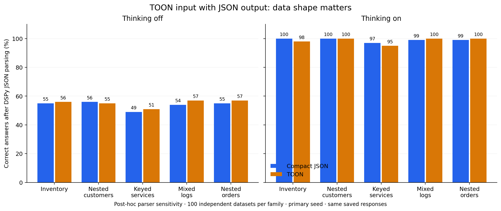

# Interpretation: when TOON input helps

**The upstream reproduction supports TOON, and the tool-result experiment finds a real, shape-dependent token advantage.** The results apply to input encoding with fixed output requirements, not to generating TOON output.

## Upstream: a measured advantage, with output-format sensitivity

On the 203 ordinary-comprehension questions without thinking, the official score is 61.6% for TOON versus 54.2% for compact JSON and 60.6% for pretty JSON. TOON uses 8.9% fewer total tokens than compact JSON on these questions. The TOON-minus-compact score gap is +7.4 points; its paired source-dataset cluster interval is approximately [+3.0, +12.7] points across only eight source datasets. These results do not establish multi-model generality.

A trace audit of all 21 ordinary-question disagreements found six compact-JSON responses containing the correct scalar inside a one-key JSON object. The upstream string normalizer rejects that wrapper even though the answer content is correct. For example, {"department":"Operations"} versus Operations. Applying a separately labeled one-key-scalar unwrapping rule to every arm raises compact JSON to 57.1%; TOON stays at 61.6%. This reduces the observed gap to 4.4 points. It is post-hoc sensitivity, not a replacement for the official scorer. Other disagreements include genuinely different counts and excessive copying of source records.

With thinking, official ordinary scores are 98.5% for both JSON variants and 99.0% for TOON, with no clear accuracy advantage. TOON uses 5.1% fewer total tokens than compact JSON on this fixed question set. The token advantage is not stable across resampling the small set of source datasets; do not universalize the aggregate percentage.

## Tool results: DSPy parsing removes a misleading gap

The frozen primary metric requires standard JSON parsing before answer comparison. Without thinking, TOON-input responses often put correct JSON inside Markdown fences. This makes the primary scores look like 21.0% TOON versus 49.0% JSON. That is not an appropriate standalone claim about factual comprehension.

The preregistered fence-removal sensitivity yields 55.2% TOON versus 53.8% JSON. A post-hoc pass using installed DSPy JSONAdapter.parse produces exactly those same correctness totals. All 2,000 primary responses are accepted with a string result by that parser. The following table uses this post-hoc DSPy parser analysis; the original frozen primary metric remains in REPORT.md.

| Thinking | Compact JSON | TOON input | TOON − JSON [95% paired CI] | TOON total-token change |
|---|---:|---:|---:|---:|
| off | 53.8% | 55.2% | +1.4 pp [-1.0, +3.8] | -17.3% |
| on | 99.0% | 98.6% | -0.4 pp [-1.8, +1.0] | -8.4% |

The accuracy differences are inconclusive; these are not formal non-inferiority tests. Tokens include reasoning and failed answers. Primers differ by input format. Results use 500 independently generated synthetic datasets with fixed question templates and one primary response per format/mode.

### Where the token saving comes from

| Family | DSPy-parsed JSON / TOON accuracy, thinking on | TOON total-token change off / on |
|---|---:|---:|
| Uniform inventory | 100% / 98% | -42.0% / -23.4% |
| Uniform nested customers | 100% / 100% | -46.6% / -26.6% |
| Keyed service maps | 97% / 95% | -37.9% / -17.1% |
| Semi-uniform logs | 99% / 100% | +22.7% / +13.5% |
| Orders with nested item arrays | 99% / 100% | +2.4% / +3.3% |

100 datasets per family. Similar point estimates do not prove equal accuracy. Uniform nested objects benefit because their repeated fields can be folded into tabular headers; varying nested item arrays and irregular records do not provide the same compression. Reference and extension encoders are byte-identical on all 500 inputs.

## Repeat-subset limitation discovered during audit

The frozen protocol incorrectly says the index-divisible-by-five repeat subset covers every task type. Auditing the selected cases shows it excludes string lookup and couples task to size: 10-row numeric lookup, 30-row count, 100-row sum and 300-row filter. It does cover all five families and all four sizes. Its lower thinking-off accuracy is therefore not comparable with the full 500-case average. Use it only as paired seed sensitivity on that specific subset. The primary 500-case design is balanced across all task types and sizes. Requests, source and the original protocol are preserved unchanged; this correction does not alter the primary scores.

## Blog conclusion

> On our Qwen deployment, TOON was effective as an input encoding for uniform records and keyed or uniformly nested objects. With DSPy JSON output parsing, accuracy was similar in this sample and total tokens were lower. Irregular logs and nested order arrays favored compact JSON on tokens. Output parsing and benchmark answer normalization can materially change the apparent accuracy ranking.

Keep three claims separate: input compression, task correctness under a stated parser, and ability to generate valid TOON. The earlier extraction experiments and this input-comprehension study measure different parts of the system.

## Evidence

- [Full frozen-metric report](REPORT.md), [protocol](PROTOCOL.md), [metrics CSV](metrics.csv), [paired comparisons](paired.csv).
- [DSPy parser sensitivity](parser_sensitivity_summary.json), [paired parser sensitivity](parser_sensitivity_paired.json), [per-response parser analysis](parser_sensitivity.jsonl).
- [All upstream disagreements](upstream_disagreements.json), [wrapper sensitivity](wrapper_sensitivity_summary.json).
- Post-hoc scripts parser_sensitivity.py and upstream_wrapper_sensitivity.py are stored beside this document. They only reanalyze saved outputs and make no model calls.
