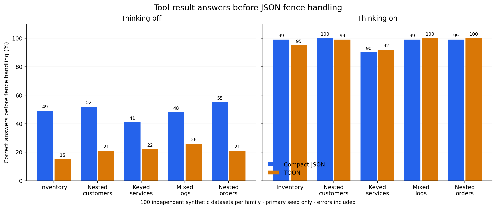
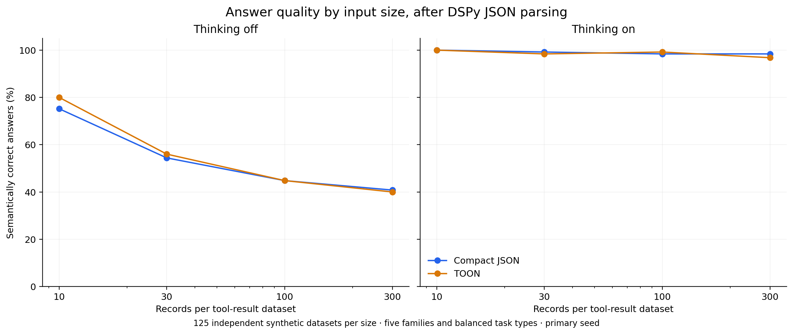

# TOON input comprehension: upstream reproduction and tool-result study

Completed **4,082 generation requests** on the user-provided Qwen/Qwen3.8-27B-FP8 deployment. This is a separate experiment from the earlier DSPy output-generation comparison. The two tracks measure reading serialized data with fixed output requirements.

Upstream: **244 questions sharing 13 source datasets**, 1,682 calls. Tools: **500 independent synthetic datasets**, 2,000 primary calls plus 400 repeated-seed calls on 100 selected datasets. Repeated calls are not additional independent cases.

Read [the interpretation and parser audit](INTERPRETATION.md) before using a winner claim. It explains the fence effect, upstream wrapper sensitivity, and a repeat-subset selection limitation.

## Upstream reproduction

Pinned [source revision](https://github.com/toon-format/toon/tree/f151a5d830d001bc244395b891183cba37e0d935). Unchanged upstream question/data generators, reference encoder, evaluation prompt and answer normalizer. Qwen settings differ from upstream provider defaults: temperature 0.6, top_p 0.95, 32K output cap, thinking off/on. No YAML/XML arms. No claim of reproducing the original multi-model averages.

Percent correct; **thinking off / on**. Ordinary comprehension excludes structure-awareness and validation questions.

| Population | Questions per format | Pretty JSON | Compact JSON | TOON |
|---|---:|---:|---:|---:|
| Full upstream suite | 244 | 63.9 / 97.1 | 55.7 / 97.1 | 67.2 / 98.0 |
| Ordinary comprehension | 203 | 60.6 / 98.5 | 54.2 / 98.5 | 61.6 / 99.0 |


### Matched flat subset (CSV is supported)

| Format | Questions per mode | Score off / on | Prompt tokens off / on |
|---|---:|---:|---:|
| json-pretty | 109 | 49.5 / 93.6 | 1,140,676 / 1,145,036 |
| json-compact | 109 | 44.0 / 95.4 | 788,128 / 792,488 |
| toon | 109 | 53.2 / 97.2 | 627,471 / 631,831 |
| csv | 109 | 50.5 / 94.5 | 603,862 / 608,222 |

### Upstream question categories

| Category | n per mode | Compact JSON off / on | TOON off / on |
|---|---:|---:|---:|
| field-retrieval | 92 | 89.1 / 98.9 | 100.0 / 98.9 |
| aggregation | 63 | 28.6 / 96.8 | 36.5 / 98.4 |
| filtering | 48 | 20.8 / 100.0 | 20.8 / 100.0 |
| structure-awareness | 36 | 63.9 / 94.4 | 94.4 / 91.7 |
| structural-validation | 5 | 60.0 / 60.0 | 100.0 / 100.0 |

**Validation is only five questions per mode.** Upstream post-encode corruption preserves TOON’s expected length/width metadata. JSON does not receive matching expected-count metadata, so this track measures that built-in information advantage as well as format comprehension. Do not pool it into a broad accuracy claim without showing the ordinary-QA result.

### Paired differences on ordinary comprehension

TOON minus baseline. Dataset-cluster bootstrap resamples the source datasets; question bootstrap treats the fixed catalog’s questions as units. Few source datasets limit generalization. Intervals are exploratory 95% intervals from 10,000 resamples, without multiplicity correction.

| Thinking | Baseline | Matched n | Gap, pp [question CI] | Source-cluster CI | Prompt change | Total-token change |
|---|---|---:|---:|---:|---:|---:|
| off | json-compact | 203 | +7.4 [+3.4, +11.8] | [+3.0, +12.7] | -7.6% | -8.9% |
| off | json-pretty | 203 | +1.0 [-2.5, +4.4] | [-2.2, +3.6] | -39.2% | -39.1% |
| off | csv | 88 | -1.1 [-5.7, +3.4] | [-8.0, +7.1] | +3.8% | +4.1% |
| on | json-compact | 203 | +0.5 [-1.0, +2.0] | [+0.0, +1.4] | -7.6% | -5.1% |
| on | json-pretty | 203 | +0.5 [-1.0, +2.5] | [-1.2, +2.0] | -39.0% | -33.9% |
| on | csv | 88 | +1.1 [+0.0, +3.4] | [+0.0, +2.9] | +3.8% | +6.8% |

## Tool-result input comparison

Inventory, nested customer records, keyed service maps, semi-uniform logs, and orders containing nested item arrays. Both inputs request the same JSON result output. These are controlled synthetic application-shaped records, not real production API traffic. 100 independent datasets per family; 25 at each of 10/30/100/300 rows. Five balanced query types. Gold answers are computed directly from source data. All 500 TOON encodings are byte-identical to the pinned reference implementation.

Primary seed only. Semantic correctness requires standard JSON parsing and a result scalar matching the gold after stripped case-insensitive string comparison. Numeric scalars may earn semantic credit; strict validity additionally requires exactly one result key with a string value. Outer-fence removal is reported separately as a sensitivity metric.

| Family | n per mode | Compact JSON score off / on | TOON score off / on |
|---|---:|---:|---:|
| inventory | 100 | 49.0 / 99.0 | 15.0 / 95.0 |
| customers | 100 | 52.0 / 100.0 | 21.0 / 99.0 |
| services | 100 | 41.0 / 90.0 | 22.0 / 92.0 |
| logs | 100 | 48.0 / 99.0 | 26.0 / 100.0 |
| orders | 100 | 55.0 / 99.0 | 21.0 / 100.0 |



| Thinking | Family | TOON − JSON, pp [95% CI] | Prompt change | Total-token change [95% CI] |
|---|---|---:|---:|---:|
| off | all | -28.0 [-32.6, -23.4] | -17.4% | -17.3% [-20.7, -13.9] |
| off | inventory | -34.0 [-44.0, -24.0] | -42.3% | -42.0% [-42.4, -41.5] |
| off | customers | -31.0 [-41.0, -21.0] | -46.8% | -46.6% [-47.0, -46.1] |
| off | services | -19.0 [-29.0, -10.0] | -38.2% | -37.9% [-38.4, -37.3] |
| off | logs | -22.0 [-32.0, -12.0] | +22.7% | +22.7% [+22.7, +22.8] |
| off | orders | -34.0 [-45.0, -24.0] | +2.3% | +2.4% [+2.1, +2.6] |
| on | all | -0.2 [-2.2, +1.8] | -17.3% | -8.4% [-11.6, -5.2] |
| on | inventory | -4.0 [-9.0, +0.0] | -41.9% | -23.4% [-29.9, -16.2] |
| on | customers | -1.0 [-3.0, +0.0] | -46.4% | -26.6% [-32.2, -20.8] |
| on | services | +2.0 [-6.0, +10.0] | -37.7% | -17.1% [-25.5, -7.0] |
| on | logs | +1.0 [+0.0, +3.0] | +22.4% | +13.5% [+4.1, +20.4] |
| on | orders | +1.0 [+0.0, +3.0] | +2.3% | +3.3% [+1.0, +5.7] |




### Semantic accuracy and output contract

| Thinking | Input format | n | Semantic score | Strict JSON outputs | Score after optional fence removal | Truncated |
|---|---|---:|---:|---:|---:|---:|
| off | json-compact | 500 | 49.0% | 473 | 53.8% | 0 |
| off | toon | 500 | 21.0% | 272 | 55.2% | 0 |
| on | json-compact | 500 | 97.4% | 492 | 99.0% | 0 |
| on | toon | 500 | 97.2% | 493 | 98.6% | 0 |

### Seed sensitivity on the predefined 100-dataset subset

| Thinking | Input | Seed 1 accuracy | Seed 2 accuracy | Correctness flips / 100 |
|---|---|---:|---:|---:|
| off | json-compact | 29.0% | 29.0% | 10 |
| off | toon | 6.0% | 10.0% | 16 |
| on | json-compact | 98.0% | 96.0% | 6 |
| on | toon | 97.0% | 95.0% | 4 |

The repeated subset is not pooled into the primary 500-case score. Correctness flips measure sensitivity to the second seed and uncontrolled batching; they do not identify its internal cause.

## Accounting and limits

- Completed calls: 4,082; transport errors: 0; token-limit finishes: 0.
- Reported total tokens across all calls, including repeat seeds and failures: 22,923,975.
- Completion tokens include reasoning; provider reasoning-token breakdown is unavailable. Counts include format primers and other instructions.
- Latency is end-to-end at concurrency 50, with uncontrolled server load and caching. It is not an isolated format speed comparison.
- One server-reported model deployment; checkpoint files were not inspected. Public-source training contamination is not ruled out.
- The synthetic generator varies records but uses a small fixed set of question templates. Its independent datasets do not establish coverage of arbitrary business workflows.
- This is input serialization research. It does not establish the reliability of generating TOON output, or a causal quality gain from the TOON 4.1 upgrade.

## Reproduce and inspect

- [Frozen protocol](PROTOCOL.md), [manifest](manifest.json), [encoder verification](encoder_verification.json), [analysis freeze](analysis_freeze.json).
- [Metrics CSV](metrics.csv), [paired comparisons](paired.csv), [seed sensitivity](seed_sensitivity.csv), [scored traces](scored.jsonl).
- [Requests](requests.jsonl), [raw responses](responses.jsonl), [upstream cases](upstream_cases.json), [tool cases](tool_cases.json).
- Upstream source is preserved in upstream_source.tar; the locked dependency graph is inside that archive. Five figures are available as editable SVG and 220-DPI PNG.

```sh
.venv/bin/python -m benchmarks.input_study_analysis
.venv/bin/python -m benchmarks.input_study_report
uv run --no-project --with matplotlib==3.10.7 python benchmarks/input_study_plots.py
```
