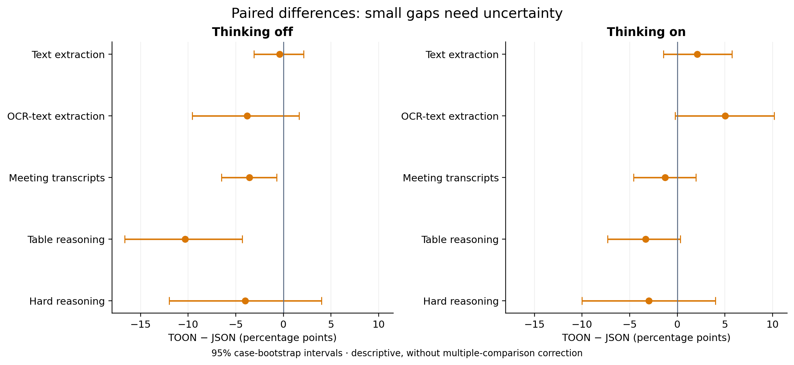
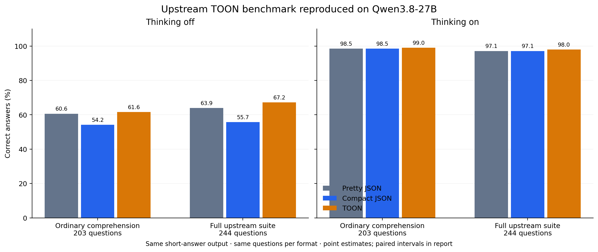
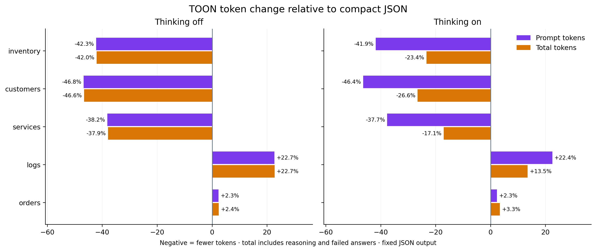

# TOON vs JSON in DSPy: where the token savings survive

*Draft. Experiments on one Qwen3.8-27B-FP8 deployment, using DSPy 3.3.1 and TOON 4.1.*

On 100 datasets of uniformly nested customer records, TOON input reduced total token use by 26.6% with thinking enabled. Both formats answered every question correctly after DSPy's JSON parser handled the output.

On irregular logs, TOON used 13.5% more total tokens.

The difference came from the data shape. Another distinction took longer to separate in the experiments: asking a model to read TOON and asking it to produce TOON put different demands on the model.

I maintain [dspy-toon](https://github.com/Archelunch/dspy-toon), a TOON adapter for DSPy. While updating it to DSPy 3.3.1 and TOON 4.1, I wanted to measure whether the extension helped beyond making serialized examples look shorter. The work grew into two expanded studies with 8,458 generation requests, plus an earlier pilot that I keep separate here.

The first study made JSON look like the better default. Reproducing TOON's own benchmark changed that assessment. Inspecting the outputs changed it again: some apparent accuracy losses were correct answers wrapped in a format the scorer rejected.

I would now consider TOON input for uniform records, with JSON output and a parser whose behavior I have checked. I would keep compact JSON for the irregular structures we tested. I would not choose either based on a token-count screenshot alone.

## What TOON compresses

JSON repeats field names in every record. TOON can declare them once in a tabular header. It also supports nested field groups and keyed tables, which let repeated structure inside uniform nested objects or dictionaries share a header.

The distinction became visible during the codec upgrade. These are serialization counts from the Qwen tokenizer on our vLLM server, using identical Python values:

| Data shape | Old codec | TOON 4.1 codec | Compact JSON |
|---|---:|---:|---:|
| 20 uniform nested records | 585 | 274 | 443 |
| 20 keyed uniform records | 352 | 220 | 254 |
| Existing mixed array example | 68 | 68 | 47 |

*Qwen token counts from the server's `/tokenize` endpoint with `add_special_tokens=false`, covering serialized data only. They exclude chat framing, instructions and generated output. The [upgrade notes](../UPGRADE.md) contain the input definitions and the older, separately labeled `cl100k_base` measurements.*

The nested-record example is encouraging. The mixed array is a reminder to measure the actual data you intend to send.

The compression features arrived in TOON 4.0; 4.1 further specifies encoding and parsing behavior. Our model experiments use the upgraded implementation, but they do not compare old and new TOON adapters on the same model tasks. I cannot attribute a model-quality improvement to the specification upgrade itself. The [pinned specification changelog](https://github.com/toon-format/spec/blob/d6db4b04303bdea132351ce45aed612311c850b2/CHANGELOG.md) explains those version changes.

## What we ran

The server identified the model as `Qwen/Qwen3.8-27B-FP8`, running on vLLM. We did not inspect its checkpoint files.

Both expanded studies used temperature `0.6`, `top_p=0.95`, a 32,768-token output cap, paired case seeds, and native thinking on or off. We sent up to 50 requests concurrently. A job made one HTTP request, with no model retry or repair call. We saved requests, final outputs, reasoning, and provider-reported token usage.

| Experiment | Cases | Requests | What changed |
|---|---|---:|---|
| DSPy JSON vs TOON adapters | 544 cases across five workloads | 2,176 | Complete adapter prompt and parser, thinking off/on |
| Input/output combinations | 250 cases reused from that study | 2,000 | JSON or TOON input crossed with JSON or TOON output |
| Native JSON-schema decoding | 100 selected compatible cases | 200 | Constrained JSON generation |
| Upstream TOON reproduction | 244 questions sharing 13 datasets | 1,682 | Pretty JSON, compact JSON, TOON; CSV on its supported subset |
| Synthetic tool-result inputs | 500 independent datasets | 2,000 | Compact JSON or TOON input, fixed JSON output |
| Second generation seed | 100 of those tool datasets | 400 | A repeated response under each format/thinking configuration |
| **Total** | **Counts overlap as described above** | **8,458** | |

That last number is the request count. It is not the number of independent examples. The 244 upstream questions reuse a small catalog of datasets, and the repeated-seed calls reuse the same inputs.

Both expanded studies completed without transport errors. The first had some token-limit finishes; the input-comprehension follow-up had none. Failures remained in the scoring denominators.

I use total tokens to mean prompt plus completion tokens. Every model-call chart uses `usage.prompt_tokens` and `usage.completion_tokens` returned by our vLLM server. Completion usage includes reasoning. We also sent 32 saved chat prompts to the same server's `/tokenize` endpoint, preserving their chat-template and thinking settings. All 32 counts exactly matched the original reported prompt usage. We did not use an external token-counting service. A shorter prompt can still produce a more expensive answer.

## The first study tested a lot of output generation

The 544 cases covered SOB text extraction, OCR-text extraction, meeting transcripts, TableBench numerical reasoning, and BBEH mini. The OCR and transcript workloads supplied text, not raw images or audio.

Only the 150 TableBench cases had structured table inputs. Most of the rest asked the model to extract a structured answer from prose or solve a question. Those tasks test the output adapter heavily, while giving TOON relatively little repeated input structure to compress.

On table questions without thinking, the JSON adapter scored 42.7% and the TOON adapter scored 32.3%. TOON used 26.7% fewer total tokens. The paired score difference was -10.3 percentage points, with a 95% interval from -16.7 to -4.3 points.



*Each point compares the same cases. The intervals come from paired case bootstrapping and are exploratory, without correction for multiple comparisons. These are full adapter comparisons. A score gap can include output-format failures as well as wrong answers.*

The requests help explain what this comparison means. DSPy's JSON adapter supplied field markers and JSON output instructions. Our TOON adapter supplied encoded TOON input, a syntax primer, field descriptions, and output examples. The task instructions were the same, but the complete prompts differed.

The harness called each adapter's formatter, sent the saved payload to vLLM, then called its parser. It did not run a complete DSPy LM call with automatic provider negotiation or fallback. Here are [an actual JSON request](../benchmark_results/qwen_blog_expanded/trace_audit/case_299_json_request.json) and [its paired TOON request](../benchmark_results/qwen_blog_expanded/trace_audit/case_299_toon_request.json).

I also tried holding JSON output fixed while changing the input format. On tables without thinking, TOON input saved 28.9% in total tokens but reduced the score by 9.2 points. That experiment gave me no reason to recommend the hybrid for every table task.

### Some wrong scores contained right answers

We inspected all 25 table cases where the two adapters received different scores without thinking.

JSON scored higher on 20. In four of those, TOON emitted the correct number with the wrong scalar type. The output contract required a string, but the model returned answers such as:

```toon
result: 2005
```

The required form was:

```toon
result: "2005"
```

Two more TOON responses contained the requested answer but used different presentation, such as a sentence instead of the requested concise answer. Among the five cases where TOON scored higher, one JSON answer differed from the gold only in capitalization: `australia` versus `Australia`.

There were content errors too. One question asked for the total intake of primary schools with a DCSF number below 2200. The qualifying schools each contributed 30. JSON returned 60; TOON returned 105.

The original scores remain useful for a typed application that needs a valid prediction. They are a poor substitute for reading the failed outputs when the claim is about comprehension. The [trace audit](../benchmark_results/qwen_blog_expanded/trace_audit/README.md) keeps those distinctions visible.

Native JSON-schema decoding produced schema-valid outputs in all 200 calls on the selected compatible subset. That did not make every answer correct. It also required a subset compatible with the stricter output schema, so I would not transfer that validity result to arbitrary schemas.

## Reproducing TOON's own benchmark

TOON's upstream benchmark asks the model to read formatted data and return a short answer. It explicitly does not test generating TOON. That is much closer to the use case where its input compression should help.

We pinned [upstream revision `f151a5d`](https://github.com/toon-format/toon/tree/f151a5d830d001bc244395b891183cba37e0d935) and reused its dataset generators, question generator, reference encoder, prompt, and answer normalizer. We changed the deployment to our Qwen server and used the generation settings above. This reproduces the task on our setup, not the original multi-model averages.

| Upstream population | Questions per format | Pretty JSON, thinking off/on | Compact JSON, thinking off/on | TOON, thinking off/on |
|---|---:|---:|---:|---:|
| Full suite | 244 | 63.9% / 97.1% | 55.7% / 97.1% | 67.2% / 98.0% |
| Ordinary comprehension | 203 | 60.6% / 98.5% | 54.2% / 98.5% | 61.6% / 99.0% |

Ordinary comprehension excludes 36 structure-awareness questions and five structural-validation questions. I separate those because TOON's declared length can make a missing row detectable when the same information is absent from JSON.



*Official upstream scoring on our Qwen deployment. These bars are point estimates. The [full report](../benchmark_results/qwen_input_study/REPORT.md) includes paired uncertainty and the matched CSV subset.*

Without thinking, TOON beat compact JSON by 7.4 points on ordinary comprehension and used 8.9% fewer total tokens. Resampling the eight source datasets gave a score-difference interval of approximately +3.0 to +12.7 points. That supports a TOON advantage on this catalog, though eight datasets provide limited evidence about other workloads.

The baseline also matters. Against pretty JSON, TOON saved 39.1% in total tokens on those same questions, but its one-point score advantage was inconclusive. A claim about saving roughly 40% needs to say which JSON representation it uses.

CSV was a useful control. On the 88 ordinary-comprehension questions where CSV applied, TOON used 4.1% more total tokens without thinking. TOON scored 1.1 points lower there, with an inconclusive accuracy difference. CSV deserves a place in comparisons of genuinely flat data.

### The upstream scorer had a wrapper effect too

Six compact-JSON responses contained a correct scalar in a one-key JSON object. For example:

```json
{"department":"Operations"}
```

The expected answer was simply `Operations`. Upstream's string scoring rejected the wrapper.

We applied a separate sensitivity rule to every format: unwrap a one-key JSON object if its value is a scalar, then use the upstream normalizer. Compact JSON rose from 54.2% to 57.1% on ordinary comprehension without thinking. TOON stayed at 61.6%.

That reduced the observed gap to 4.4 points. I keep this result separate because we chose the rule after inspecting the traces. It shows that part of the official advantage concerned answer presentation. It does not justify replacing the official score silently.

With thinking enabled, the ordinary-comprehension scores were already close to the ceiling: 98.5% for JSON and 99.0% for TOON. The measured total-token saving against compact JSON was 5.1% on that question set.

## Tool results gave TOON more suitable inputs

The next experiment used 500 independently generated datasets shaped like application tool results. Each family had 100 datasets, split evenly across 10, 30, 100 and 300 records. Questions covered numeric lookup, counting, sums, compound filters and string lookup. The generator computed gold answers directly from the records.

Both formats requested the same JSON output. We used the extension's TOON encoder for the input. All 500 encodings matched the pinned reference encoder byte for byte and round-tripped through its decoder.

These were synthetic payloads in user messages. They were not production API traffic or complete agents executing tools.

| Input shape | Compact JSON accuracy | TOON-input accuracy | TOON total-token change |
|---|---:|---:|---:|
| Uniform inventory | 100% | 98% | -23.4% |
| Uniform nested customers | 100% | 100% | -26.6% |
| Keyed service maps | 97% | 95% | -17.1% |
| Irregular logs | 99% | 100% | +13.5% |
| Orders with nested item arrays | 99% | 100% | +3.3% |

*Thinking enabled; 100 datasets per row. Accuracy uses a separately labeled pass through DSPy's JSON parser. Positive token changes mean TOON cost more. Similar accuracy estimates do not prove equivalence.*

Uniform nested customers were the most convincing result for my use case: both formats answered all 100 questions correctly, while TOON saved 26.6% of total tokens. The service-map and inventory results also saved tokens, with slightly lower observed accuracy.

The logs and orders would keep me on compact JSON. Their structure did not compress well enough to pay for TOON's representation in these samples.



*All primary requests contribute to token totals, including incorrect answers. Completion tokens include reasoning. The smaller total savings with thinking show why input-token counts alone overstate the reduction in the whole request.*

Across all 500 datasets, DSPy-parsed accuracy was 99.0% for compact JSON and 98.6% for TOON with thinking enabled. The paired difference was -0.4 points, with a 95% interval from -1.8 to +1.0. TOON used 8.4% fewer total tokens, with a paired interval for the token change from -11.6% to -5.2%.

Without thinking, accuracy was 53.8% for JSON and 55.2% for TOON. That difference was inconclusive too. TOON saved 17.3% of total tokens across this particular mixture of data shapes.

### Markdown fences changed the apparent winner

The frozen primary tool-result score required ordinary JSON parsing before comparing the answer. Many TOON-input responses put their JSON answers inside Markdown fences. A plain JSON parser rejected them.

| Thinking off, 500 datasets | Compact JSON input | TOON input |
|---|---:|---:|
| Correct answers after plain JSON parsing | 49.0% | 21.0% |
| Correct answers after removing outer fences | 53.8% | 55.2% |
| Correct answers after DSPy's JSON parser | 53.8% | 55.2% |

Fence removal was a planned sensitivity metric. The DSPy parser pass was a later check on the same saved responses, with no new model calls. Both recovered the same correctness totals.

A standalone chart of 49% versus 21% would make TOON input look disastrous. For an application using DSPy's JSON parser, that would be misleading. The parser accepted a string result from every primary response in both formats; many accepted answers were still factually wrong.

I would check this behavior before treating any structured-output benchmark as a measure of model understanding. The scored object is the result of a prompt, a model response and a parser. Changing any one of them can move the reported accuracy.

## Larger inputs made reasoning more important


*Each size contains 125 independent synthetic datasets across five families and balanced question types. These are primary-seed results with the same output contract.*

Without thinking, accuracy dropped as the record count grew. With thinking, both formats stayed near the ceiling on this generated workload. The larger differences were between reasoning modes, rather than between input formats.

This does not establish what happens near the model's full context limit. The inputs stopped at 300 records per dataset. It also does not settle latency: at concurrency 50, shared server load and caching affect the timing. Provider token counts support a clearer comparison here than a claim that one format is inherently faster.

## What I would use in an application

For uniform database rows, keyed maps, and uniformly nested records, I would try TOON input while keeping JSON output. I would measure the complete request and score the outputs through the parser the application actually uses. The customer-record result gives me a concrete reason to do that.

For irregular logs and orders containing varying item arrays, I would start with compact JSON. In this experiment, TOON increased token use on both shapes. For flat tables, I would include CSV in the comparison.

Generating TOON output needs its own evaluation. Our extraction study exposed numeric-string quoting mistakes, incorrect array counts and malformed lists. Successful TOON input comprehension does not establish reliable TOON output generation.

I would also keep the scope of these results narrow. They come from one model deployment. The upstream questions share only 13 source datasets, while the synthetic study varies records under a small set of fixed question templates. Public benchmark contamination is possible. The reported intervals are exploratory and do not correct for every comparison we examined.

We repeated a seed on 100 tool datasets, but a selection mistake limits that part of the evidence. Selecting every fifth case omitted string lookup and tied each remaining task type to one input size. The main 500-case design is balanced. The repeated subset can describe seed sensitivity within that subset; it cannot stand in for the whole study.

I would start an application trial with a tool returning uniform nested customer records: encode its input as TOON, retain JSON output, and measure accuracy and total tokens on held-out application data before making it the default.

## Data and reproducibility

The [first expanded study](../benchmark_results/qwen_blog_expanded/BLOG_DATA.md) contains the extraction results, native JSON-schema comparison, original scores and trace audit. The [input-comprehension report](../benchmark_results/qwen_input_study/REPORT.md) contains the upstream reproduction and synthetic tool-result experiment. Its [interpretation notes](../benchmark_results/qwen_input_study/INTERPRETATION.md) document parser sensitivity and the repeat-subset limitation.

For the input study, the repository preserves [requests](../benchmark_results/qwen_input_study/requests.jsonl), [raw responses](../benchmark_results/qwen_input_study/responses.jsonl), [CSV metrics](../benchmark_results/qwen_input_study/metrics.csv), [paired comparisons](../benchmark_results/qwen_input_study/paired.csv), and [DSPy parser sensitivity results](../benchmark_results/qwen_input_study/parser_sensitivity_summary.json). Each chart in this draft has an editable SVG beside its PNG in `assets/`.

The frozen protocols describe exclusions, settings and scoring: [expanded comparison](../benchmark_results/qwen_blog_expanded/PROTOCOL.md), [input study](../benchmark_results/qwen_input_study/PROTOCOL.md). The input-study interpretation notes correct the original protocol's mistaken description of the repeat subset.
